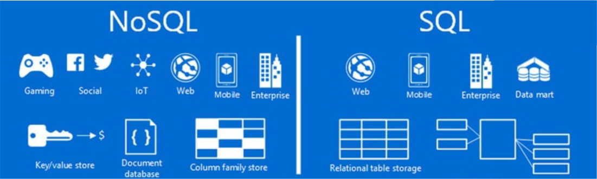

<h2 dir="rtl">نام و نام خانوادگی :: مرتضی رضازاده گلی</h2>
<h2 dir="rtl">موضوع :: تفاوت sql و nosql</h2>

  <b>SQL</b> مخفف <b>Structured Query Language</b> می باشد و به معنی زبان پرس و جوی ساختار یافته است.  ما از طریق این زبان میتوانیم با پایگاه داده ارتباط برقرار کنیم و عملیات مختلفی از جمله CRUD را انجام دهیم. 
  <b>NoSQL</b> مخفف <b>Not only SQL</b> می باشد و داده ها را در پایگاه داده های غیر جدولی ذخیره می کنند   داده‌ها را به شکلی متفاوت از جداول رابطه‌ای در حالت SQL ذخیره می‌کنند. 
  <h3 dir="rtl">7 تفاوت اصلی میان SQL و NoSQL : </h3>
     زبان برنامه نویسی 
     مقیاس پذیری 
     ساختار 
     ویژگی‌ها 
     پشتیبانی 
     نرم‌افزارهای RDBMS  
     ذخیره‌سازی در Cloud و آینده نگری  
   	دیتابیس‌های SQL بر پایه Table یا جدول هستند اما دیتابیس‌های NoSQL می‌توانند از سه دسته Key-Value, Graph database و document oriented  باشند. 
   به عنوان مثال دیتابیس MongoDB در دسته NoSQL و دیتابیس MySQL در دسته SQL قرار میگیرند. 
  به دلیل ساختار غیر جدولی دیتابیس NoSQL، سرعت اجرای آن به مراتب بالاتر از SQL است.  
  
  
  

